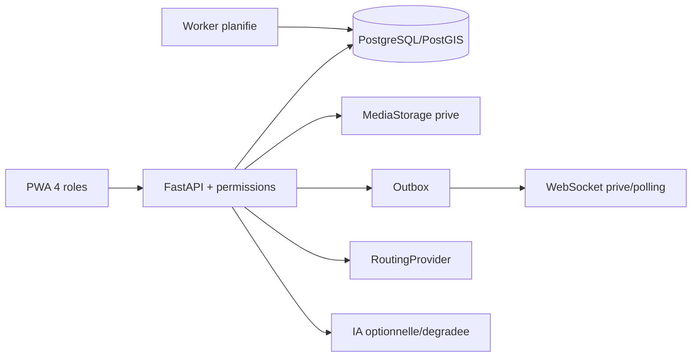
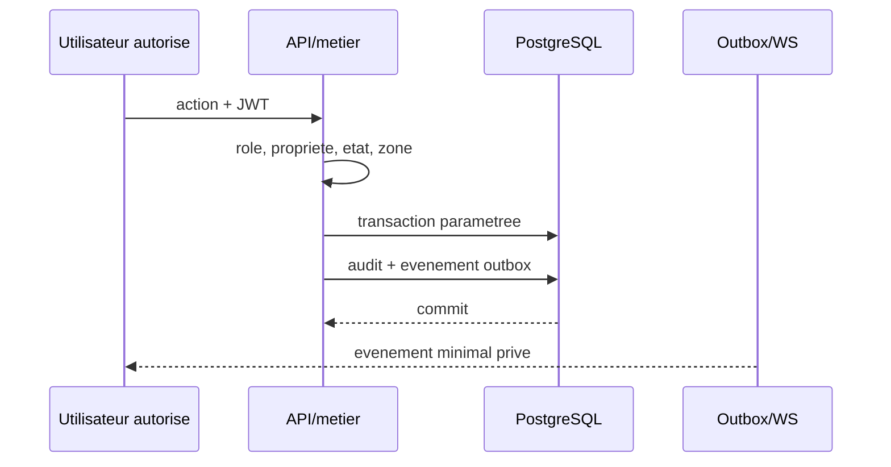
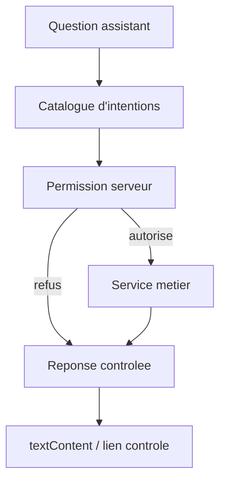

# Diagrammes conformes au code

Medias : upload valide -> fichier temporaire prive -> ligne `media_assets` dans
la transaction -> renommage atomique; acces ensuite par endpoint autorise.
Hors connexion : action UUID liee a l'identite -> file IndexedDB -> reprise ->
deduplication serveur -> suppression locale seulement apres confirmation.
